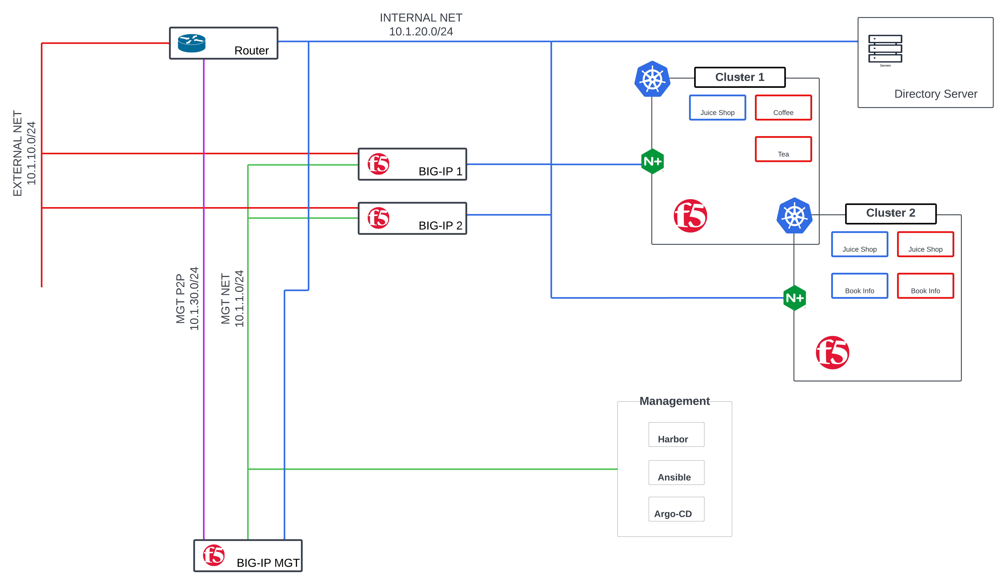

# 🛠️ BIG-IP Automation Lab Build

This repository documents the build process, software components, and Ansible playbooks used to automate the configuration and deployment of a lab environment using F5 BIG-IP. The infrastructure is designed to enable Zero Trust use cases, manage Kubernetes workloads, and provide declarative application configurations.

---

## 🗂️ Table of Contents

1. [🚀 High-Level Workflow](#-high-level-workflow)
2. [📦 Software Components](#-software-components)
3. [🌐 Network Architecture](#-network-architecture)
4. [🛠️ Setup Instructions](#️-setup-instructions)
    - [📥 Provision BIG-IP](#-provision-big-ip)
    - [📦 Deploy Declarative Onboarding (DO) and Application Services 3 (AS3)](#-deploy-declarative-onboarding-do-and-application-services-3-as3)
    - [⚙️ Update Device Configuration](#️-update-device-configuration)
    - [📜 Push Device Configuration](#-push-device-configuration)
5. [🔒 Testing Zero Trust Use Cases](#-testing-zero-trust-use-cases)
6. [📖 References](#-references)

---

## 🚀 High-Level Workflow

The major tasks involved in building and automating this lab environment are:

1. **Deploy BIG-IP Declarative Onboarding (DO) and Application Services 3 (AS3) RPMs:**  
   🛠️ Use Ansible Playbooks to upload and install F5 RPM packages on the BIG-IP device.

2. **Update BIG-IP Device Configuration:**  
   ⚙️ Configure BIG-IP interfaces, VLANs, self-IPs, and routing using Ansible.

3. **Push Application Configuration:**  
   📜 Apply application-specific configurations and enable advanced routing/security profiles using AS3.

4. **Test Zero Trust Use Cases:**  
   🔒 Verify the environment using Kubernetes workloads, simulated applications, and virtual network segmentation.

---

## 📦 Software Components

| Component                    | Type   | Container/Image/Package                             | Purpose                                                                  |
|------------------------------|--------|-----------------------------------------------------|--------------------------------------------------------------------------|
| **BIG-IP VE**                | F5     | `BIGIP-17.5.0-0.0.15.ALL-vmware.ova`                | Deploy BIG-IP in a virtualized environment.                              |
| **Declarative Onboarding**   | F5     | `f5-declarative-onboarding-1.46.0-7.noarch.rpm`     | Simplifies onboarding processes with declarative API.                    |
| **Application Services 3**   | F5     | `f5-appsvcs-3.54.0-7.noarch.rpm`                    | Enables automated application service deployments.                       |
| **K8s Ingress Controller**   | F5     | `nginx-plus-ingress:5.0.0`                          | BIG-IP integration with Kubernetes.                                      |
| **BIG-IP Controller (CIS)**  | F5     | `f5networks/k8s-bigip-ctlr:2:20.0`                  | Alternative ingress controller for Kubernetes.                           |
| **Privileger User Access**   | F5     | `privileged-user-access-3.0.11`                     | Manage Networking devices  and other components                          |
| **NGINX Ingress Helm Chart** | F5     | `nginx-ingress-2.1.0`                               | Helm chart to install NGINX Ingress Controller                           |
| **BIG-IP CIS Helm Chart**    | F5     | `f5-bigip-ctlr-0.0.35`                              | Helm chart to install BIG-IP Container Ingress Service                   |
| **Ansible Environment**      | Non-F5 | `dialtone21/f5_cis_ee:1.0.0`                        | Provides Ansible environment for F5 integration.                         |
| **Web Apps**                 | Non-F5 | `nginxdemos`, `bkimminich/juice-shop`               | Application traffic generation & security testing.                       |
| **Cert-Manager**             | Non-F5 | `cert-manager`                                      | Automates Kubernetes TLS certificate management.                         |
| **Cert-Manager Helm Chart**  | Non-F5 | `cert-manager-v1.17.2`                              | Helm chart to install Cert Manager                                       |

---

## 🌐 Network Architecture

The lab environment includes several IP subnets to segregate management, external, and internal communications, as illustrated by the following network diagram:

### Network Subnets

| Subnet | Purpose |
|--------|---------|
| `10.1.1.0/24` | **Management (MGT)**: Provides access to BIG-IP admin interfaces and monitoring portals. |
| `10.1.10.0/24` | **External (EXT)**: Handles external-facing traffic and application access. |
| `10.1.20.0/24` | **Internal (INT)**: Manages internal application communication. |
| `10.1.30.0/30` | **Point-to-Point (MGT-BIG-IP P2P)**: Point-to-point connection between the management router and BIG-IP. |

### Network Topology

The following network diagram represents the environment's topology, highlighting Kubernetes clusters, BIG-IP devices, applications, and management tools:



---

## 🛠️ Setup Instructions

### 📥 Provision BIG-IP
1. Download the BIG-IP VE OVA file (`BIGIP-17.5.0-0.0.15.ALL-vmware.ova`) from the F5 website.
2. Deploy BIG-IP VE on your virtualization platform, e.g., VMware or VirtualBox.
3. Assign the management interface an IP address from the `10.1.1.0/24` network.

---

### 📦 Deploy Declarative Onboarding (DO) and Application Services 3 (AS3)
1. Use the following Ansible Playbook to upload DO and AS3 RPMs onto the BIG-IP:

```bash

ansible-navigator run  download_atc.yml --mode stdout
ansible-navigator run  install_atc.yml --mode stdout

```

---

### ⚙️ Update Device Configuration
- Update the device configuration files location at files/do to match to your environment.

---

### 📜 Push Device Configuration
- Apply application-specific policies using Declarative Onboarding (DO) and AS3:

```bash

ansible-navigator run  do_onboarding.yml --mode stdout
```

---

## 🔒 Testing Zero Trust Use Cases

Once the BIG-IP, Kubernetes, and web applications are configured, you can proceed to test Zero Trust principles:

1. [Multi-Factor Authentication](/01-MFA/)
2. [Privileged User Access](/02-Privileged_Access/)
3. [Kubernetes Ingress](/03-Kubernetes_Ingress/)

---

## 📖 References

1. [F5 Declarative Onboarding Documentation](https://clouddocs.f5.com/products/extensions/f5-declarative-onboarding/latest/)
2. [F5 Application Services 3 (AS3) Documentation](https://clouddocs.f5.com/products/extensions/f5-appsvcs-extension/latest/)
3. [Ansible Documentation for BIG-IP Modules](https://docs.ansible.com/ansible/latest/collections/f5networks/f5_modules/index.html)
4. [Docker Hub Container Images](https://hub.docker.com/)

---

Feel free to open issues or create pull requests if you have improvements or questions. 

---

Enjoy automated cloud networking and Zero Trust application testing with F5 BIG-IP! 🚀

--- 
