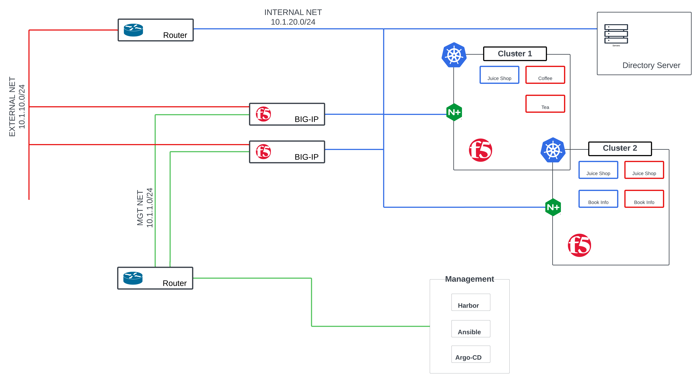

# Zero Trust POC Test Plan for F5 Tools
The architecture is segmented into management, external, and internal networks, and supports both production and staging Kubernetes clusters. This setup enables testing of Zero Trust principles such as least privilege, continuous verification, and microsegmentation.
## 🗺️ Lab Network Diagram

## 🧰 Software List

| Component | Type | Container Image | Purpose |
|-----------|------|-----------------|---------|
| GitHub Repository | None | f5networks/k8s-bigip-ctlr | Integrates BIG-IP with Kubernetes to manage ingress traƯic |
| GitHub Repository | None | f5networks/k8s-bigip-ctlr | An alternative ingress controller for Kubernetes clusters, |
| BIG-IP Virtual Editions | None | f5networks/k8s-bigip-ctlr | A virtual machine image for deploying BIG-IP in virtualized |
| GitHub Repository | None | f5networks/k8s-bigip-ctlr | Simplifies BIG-IP onboarding processes with declarative |
| GitHub Repository | None | f5networks/k8s-bigip-ctlr | Allows BIG-IP users to automate application deployments |
| Documentation | Non-F5 | dialtone21/f5_cis_ee:1.0.0 | Provides a ready-to-use Ansible execution environment for |
| GitHub Repository | Non-F5 | dialtone21/f5_cis_ee:1.0.0 | A simple web application for demonstrating NGINX |
| GitHub Repository | Non-F5 | dialtone21/f5_cis_ee:1.0.0 | A vulnerable web application specifically designed for |
| GitHub Repository | Non-F5 | dialtone21/f5_cis_ee:1.0.0 | Automates the issuance and management of TLS |
| Docker Hub | Non-F5 | balabit/syslog-ng | Centralized logging solution for collecting, filtering, and |

---

## 🔐 Privileged User Access (PUA) Documentation

### Overview and Highlights
- **Privileged User Access Solution Overview**  
  Explains how F5’s solutions enable secure and streamlined privileged user access, reducing risk through granular identity-based controls over sensitive resources.

### Tutorials and Training
- **F5 CloudDocs - IAM Lab**  
  Hands-on lab experience to understand identity and access management principles, particularly for privileged user environments.

---

## 🌐 Required IP Subnets

| Subnet | Purpose |
|--------|---------|
| `10.1.1.0/24` | **Management (MGT)** – Access to BIG-IP interfaces or admin portals |
| `10.1.10.0/24` | **External (EXT)** – Public-facing traffic and app access |
| `10.1.20.0/24` | **Internal (INT)** – Internal services and app communication |
